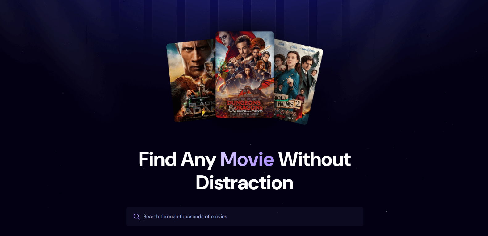
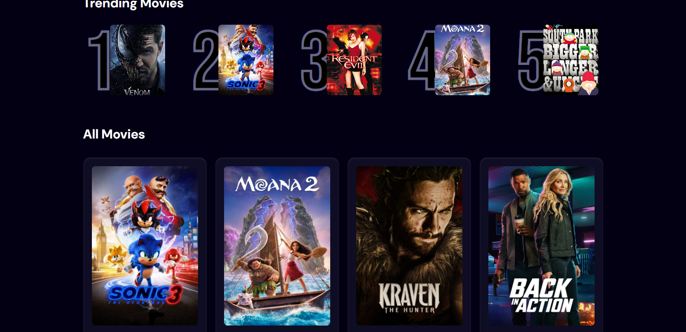

# **🎬 Movie Search App**  

This project is a **responsive React application** that allows users to **search for their favorite movies** and access key details, such as **release dates** and **descriptions**. It leverages the **TMDB API** to fetch movie data and uses **Appwrite** to track and display the most searched movies within the app.  

To optimize performance, the app implements **debounce** to reduce unnecessary API requests while users type in the search bar. Additionally, frequently searched movie titles are **ranked at the top** based on user searches, making it easier to discover trending films.  

---

## 👨‍💻 Test yourself

1. **Download** the project files to your local machine.  
2. Open your terminal or command prompt.  
3. Navigate to the project directory and run the following command to install all the necessary dependencies:  

```bash
npm install
```

4. Once the installation is complete, run the application with:

```bash
npm start
```

---

# **🛠️ Main Features**  

✅ **React for dynamic UI**  
✅ **TMDB API for movie search & details**  
✅ **Appwrite for tracking and ranking most searched movies**  
✅ **Debounce implementation to minimize API requests**  
✅ **Fully responsive design for all devices**  

---

# **📷 Screenshots**   




